## Troubleshooting Callout
4 distinct troubleshooting events were logged, demonstrating skills in resolving Docker image mismatches, pod crash loops, network policy, JSON errors, and Terraform configuration failures across GCP and ProxMox.

## DataDog
**Summary:** 
  
## EC2
**Summary:** 

- 2025-10-17 Create EC2 Instance Terraform will be installed on.
  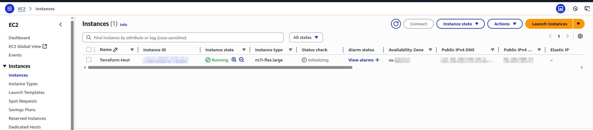

## IAM
**Summary:** 

- 2025-10-17 Create Admin group and attach AdministratorAccess policy to group.
  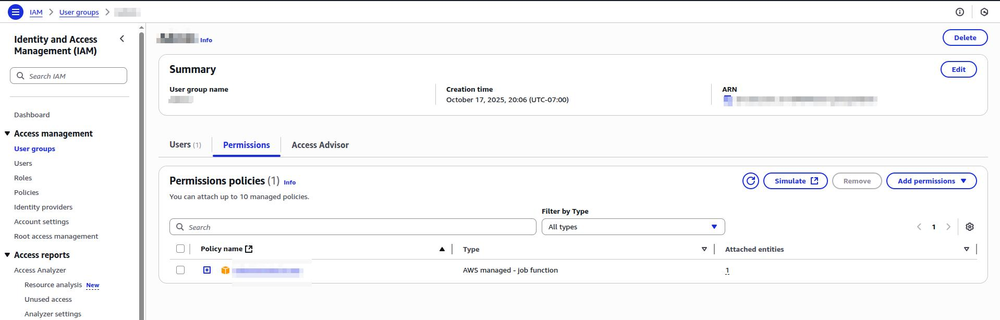
- 2025-10-17 Create admin user, add to the admin group; create and secure access keys, enable and require MFA for this account.
  
- 2025-10-17 Update minimum password requirenments for IAM users.
  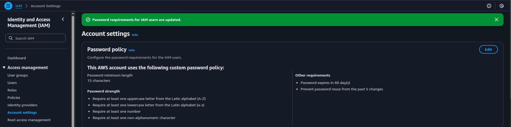
- 2025-10-17 Create EC2_Admin role to attach to EC2 instances so can be managed by Terraform (plan/apply.
  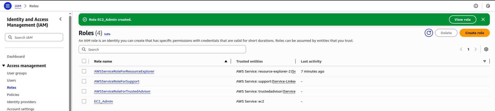

## Misc - AWS
**Summary:** 

- 2025-10-17 Install aws-cli on terraform EC2 instance for enhanced administration and troubleshooting.
  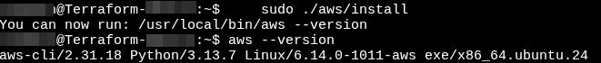

## Prometheus
**Summary:** 

## Terraform
**Summary:**

- 2025-10-17 Install Terraform on EC2 instance.
  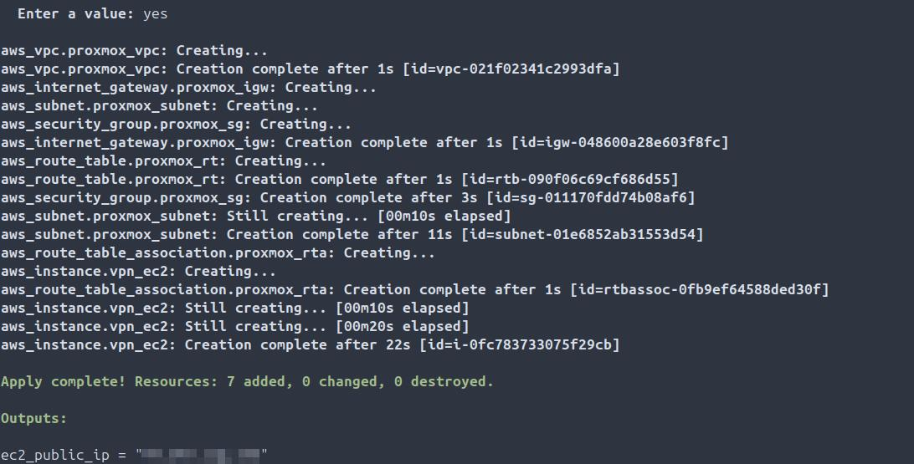
- 2025-10-17 Deploy IaC raw EC2 instances using Terraform.
  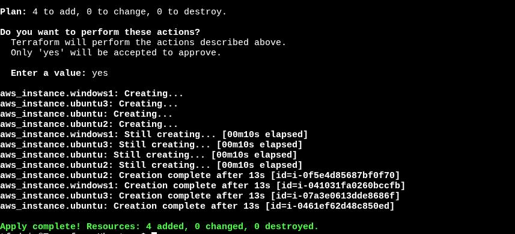
- 2025-10-17 Destroy IaC raw EC2 instances using Terraform.
  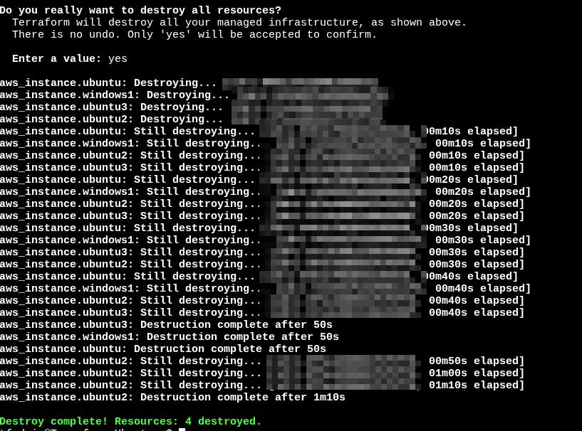

## Troubleshooting
**Summary:**

- 2025-10-17 
Problem: Providers Terraform file was missing closing brace
Root Cause: } was missing from block in providers manifest
Resolution: Added missing closing brace
Validation: Terraform plan completed with no errors returned
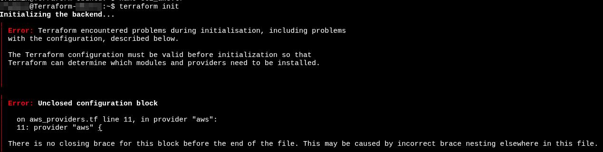
- 2025-10-17 
Problem: Terraform plan failing due to lack of permissions
Root Cause: IAM EC2 admin role was not attached to instances
Resolution: Create EC2_Admin role and attach (iam1-4)
Validation: Terraform plan completed with no errors returned
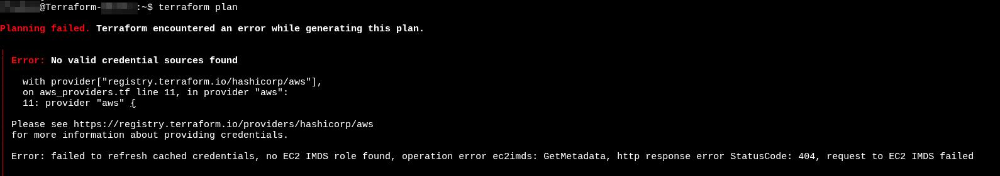
- 2025-10-17 
Problem: AMI annotated in compute manifest is not downloading
Root Cause: Version of Ubuntu server annotated (24.02) is not available currently in US-WEST-2
Resolution: Using AWS-CLI query for available AMI, update compute manifest for the latest version available (22.04)
Validation: Terraform apply completed and infra was provisioned
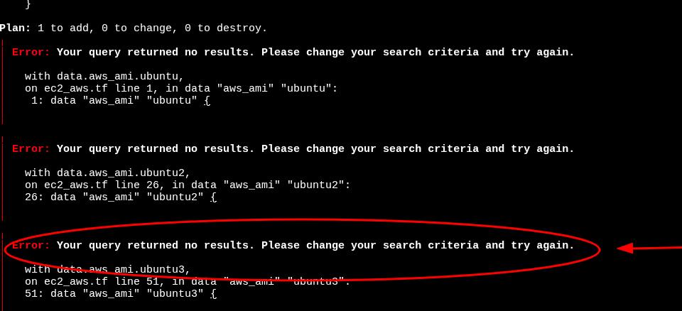

## VPC
**Summary:** 
