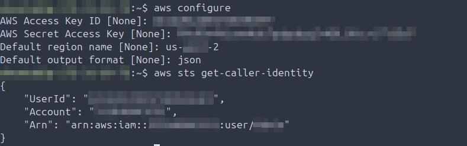
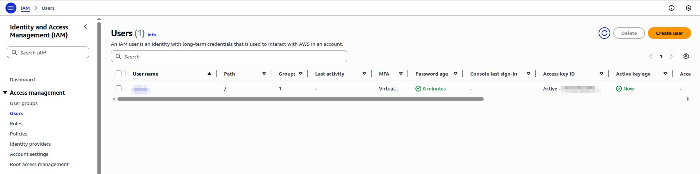

## Troubleshooting Callout
11 distinct troubleshooting events were logged.

## DataDog
**Summary:** 

- 2025-10-19 Install DataDog agent on all on-prem guests; vaidated service was running; validated running in a good state on all guests
  
- 2025-10-19 Validate installed DataDog agent is returning metrics on one of installed on-prem guests
  
- 2025-10-19 Additional smoke test on one of on-prem guests by tailing and validating DataDog logs
  
- 2025-10-19 AMIs (host_alias) are showing up in DataDog graphs, updated the agent config on each to reflect the hostname then restart the service and validate agent health
  
- 2025-10-19 DataDog dashboard single pane of glass view (Migrated from Prometheus)
  
- 2025-10-19 Net_Sent dashboard
  
- 2025-10-19 CPU_utilization dashboard
  
- 2025-10-19 Net_Recv dashboard
  
- 2025-10-19 Host_Uptime dashboard
  
- 2025-10-19 MEM_Utilization dashboard
  
- 2025-10-19 Disk_Utilization dashboard
  

## EC2
**Summary:** 

- 2025-10-19 Install AWS-CLI on EC2 instance
  
- 2025-10-19 Create RSA key pair, add to EC2 instance, install Terraform, validate version.
  
- 2025-10-19 Create access key pair, configure AWS-CLI, then validate.
  

## IAM
**Summary:** 

- 2025-10-19 Create Admin group and attach AdministratorAccess policy to group.
  
- 2025-10-19 Create admin user, add to the admin group; create and secure access keys, enable and require MFA for this account.
  
- 2025-10-19 Update minimum password requirenments for IAM users.
  
- 2025-10-19 Create EC2_Admin role to attach to EC2 instances so can be managed by Terraform (plan/apply.
  
- 2025-10-19 Create Prometheus service account in AWS account
  
- 2025-10-19 Attach EC2ReadOnlyAccess user policy to Prometheus service account
  
- 2025-10-19 Create access keys for Prometheus service account
  
- 2025-10-19 Export Prometheus service accountaccess and secret keys, validate service account user account details
  

## Prometheus
**Summary:** 

- 2025-10-19 Install Prometheus and Node Exporter on on-prem guest; validate Prometheus version installed and node-exporter service is running
  
- 2025-10-19 Install node-exporter on S2S peer in AWS account (EC2 instance)
  
- 2025-10-19 After validating VPN peering, Prometheus installed on on-prem guest; scraping both EC2 instance in AWS account via S2S VPN and on-prem; validate all guests present and returning an up status
  
- 2025-10-19 Comment out scrape jobs and targets in Prometheus as part of DatDog migration
  
- 2025-10-19 Validated all targets have been vacated from Prometheus as have been migrated to dataDog
  

## Terraform
**Summary:**

- 2025-10-19 Provisioned IaC resources using Terraform in AWS account.
  
- 2025-10-19 Install Terraform on on-prem guest
  
- 2025-10-19 Provision compute resources on-prem via Terraform
  

## Troubleshooting
**Summary:**

- 2025-10-17 

Problem: Providers Terraform file was missing closing brace

Root Cause: } was missing from block in providers manifest

Resolution: Added missing closing brace

Validation: Terraform plan completed with no errors returned

- 2025-10-17 

Problem: Terraform plan failing due to lack of permissions

Root Cause: IAM EC2 admin role was not attached to instances

Resolution: Create EC2_Admin role and attach (iam1-4)

Validation: Terraform plan completed with no errors returned

- 2025-10-17 

Problem: AMI annotated in compute manifest is not downloading

Root Cause: Version of Ubuntu server annotated (24.02) is not available currently in US-WEST-2

Resolution: Using AWS-CLI query for available AMI, update compute manifest for the latest version available (22.04)

Validation: Terraform apply completed and infra was provisioned

- 2025-10-19 

Problem: Terraform plan failing

Root Cause: VPC had typo in vpc_id in manifest, corrected and plan ran to completion

Resolution: Corrected manifest typo

Validation: Terraform plan completed, moved to apply after validating no other issues

- 2025-10-19 

Problem: Terraform apply failing

Root Cause: The originally specified AMI was not available in the desired region

Resolution: Located alternate AMI and updated manifest

Validation: Terraform apply ran ran to completion

- 2025-10-19 

Problem: Terraform is failing when attempting to plan provisioning on-prem compute infra

Root Cause: Provider block was not specified correctly in manifest in accordance with provider specifications

Resolution: Updated manifest to provider specifications and plan completed without issue

Validation: Terraform plan completed without issue after correcting

- 2025-10-19 

Problem: Terraform plan is failing when preparing to provision on-prem compute resources

Root Cause: Aliases used in provider block were not written correctly per vendor specifications

Resolution: Researched and updated manifest so aliases match provider specifications

Validation: Terraform plan completed without issue after correcting

- 2025-10-19 

Problem: Port forwarding from laptop to EC2 failing due to SSH timing out between peered proxmox guest and EC2 instance

Root Cause: RSA keypair was failing despite originally configuring, and portforwarding was configured incorrectly 

Resolution: Re-created RSA keypair and updated portforwarding syntax

Validation: Validated both tunnel and handshakes returned good; validated SSH; validated portforwarding remainded up

- 2025-10-19 

Problem: Datadog agent will not complete API call; nothing in populating dashboard in DataDog GUI

Root Cause: Two - API key in config was incorrect, and app key was malformed

Resolution: Regenerated new keys, updated config, restarted the agent, validated the agent was healthy and returning expected output 

Validation: Dashboard is now returning metrics for guest as expected

- 2025-10-19 

Problem: DataDog agent unreachable and returning connection refused

Root Cause: Config was pointing to the incorrect region which was causing the agent to fail connection attempts

Resolution: Updated the site specified in the agent config and restarted the agent 

Validation: Agent can now connect to the correct region and is passing metrics

- 2025-10-19 

Problem: The DataDog agent was importing the hostname_alias (AMI) instead of the hostname for all EC2 instances, which is showing up in the created graphs on the web GUI instead of the desired hostnames

Root Cause: Hostname was not defined in the config which was causing the agent to default to the alias

Resolution: Updated the config file to reflect the proper hostname, ensured the alias was commented out, restarted the service, validated agent health 

Validation: Validated the hostname is now showing up in all created dashboards

## VPN
**Summary:**

- 2025-10-19 Bring up Wireguard on on-prem guest, validate can ping peer in AWS account, and handshake completed succesfully 
  
- 2025-10-19 Bring up Wireguard on EC2 instance, validate can ping peer hosted on on-prem hypervisor, and handshake completed succesfully 
  
## VPC
**Summary:** 
